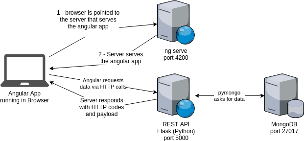
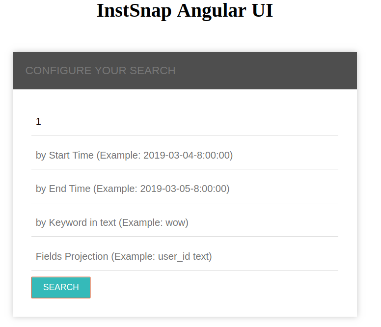
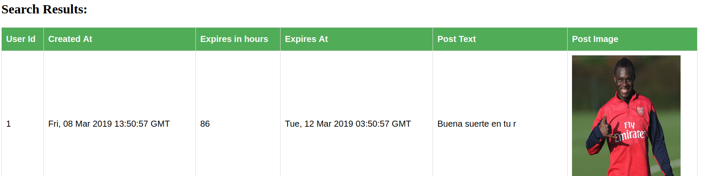

# InstSnap BACC

A "walking skeleton" web app build with Angular, Flask (Python) and MongoDB

## Architectural overview


The above diagram gives an overview of the application architecture.
It consists basically of 3 main blocks, the **database**, the **API Server** 
and the server that **serves the frontend**.

The user points his/her browser to (in our case) http://localhost:4200 and the
 **ng server** serves the angular application to the browser. Once the angular app is loaded, it starts
 the conversation via HTTP against the REST API that resides in http://localhost:5000 
 in order to retrieve data. 

Finally, the REST API service gets its data from MongoDB server listening in **localhost:27017** 

### Why MongoDB
MongoDB falls in the category of **documental databases** from the NoSQL landscape, more concretely,
 it stores documents in JSON format (actually BJSON to save some space).

Generally speaking, you may be interested in MongoDB for one or both of the following **two main reasons**:

* You need to store **huge amount of data**, so yo need to scale horizontally using shards
* For convenience as a programmer (specially if you are using an OO programming language), as objects maps 
quite naturally to a document (json), so the [impedance mismatch](https://en.wikipedia.org/wiki/Object-relational_impedance_mismatch) is almost non existent 

For this prototype application, the reasoning behind using MongoDB is the second one. 

### Why Flask
It is really hard to personally evaluate and compare frameworks in just three days. 
My approach here has been to google a little bit, trying to find someone else opinions, and to get
a first impression just reading simple ___"hello world"___ code samples.

I found **two popular frameworks** to build REST services in Python:
* Django
* Flask

Django seems to be a **heavyweight framework**, similar to Spring Data Rest / MVC, so I decided that
probably it was too much to learn in such a short period of time.

I found that Flask was extremely **light and simple to setup** and was covering perfectly the
use case I had at hands, so I finally **decided to use Flask**.   

### Why Angular
Finding and learning a server side framework equivalent to [Vaadin](https://vaadin.com/) or 
[ZK](https://www.zkoss.org/) in Python was absolutely out of scope. I already had some (very light)
familiarity with Angular, so it has been my only reasonable option for the frontend. 


## Running the app

### Running MongoDB
The first step is to run the database. The probably easiest way is to run a docker container from
the official MongoDB image, but the requisite is to have docker already 
[installed](https://docs.docker.com/install/linux/docker-ce/ubuntu/) in your computer.

```bash
sudo docker run -p 27017:27017 --name mongodb_posts mongo:4.0
```

If container is running correctly, you should see something like the following:

```bash
jlsoler@asus:~/projects/InstSnap$ sudo docker ps
CONTAINER ID        IMAGE               COMMAND                  CREATED             STATUS              PORTS                      NAMES
1e01cca0e587        mongo:4.0           "docker-entrypoint.s…"   37 hours ago        Up 4 hours          0.0.0.0:27017->27017/tcp   posts

```

Alternatively you can also [download](https://www.mongodb.com/download-center/community) the binaries and 
follow the official instructions.


### Loading the dataset
Under ___resources directory___, a Python script called ___postsImporter.py___ can be found. 
This script will load the posts data from the spreadsheet and will insert it into MongoDB.

> Make sure MongoDB is already running in **localhost:27017** 
> and that you are at the root of the project before running the script

```bash
 export PYTHONPATH=.; python resources/postsImporter.py 
```

### Running the Backend
In order to run the REST API you should issue the following command from the project root directory:

```bash
export PYTHONPATH=.; python app.py
```

If it started correctly, you should see something like the following:

```bash
jlsoler@asus:~/projects/InstSnap$ export PYTHONPATH=.; python app.py 
 * Running on http://127.0.0.1:5000/ (Press CTRL+C to quit)
 * Restarting with stat
 * Debugger is active!
 * Debugger PIN: 267-195-301

```

#### Exercising the API

```bash
jlsoler@asus:~$ echo '{"user_id":1, "start_time":"2019-03-04", "end_time":"2019-03-05"}' | http -v POST localhost:5000/api/posts/_search
POST /api/posts/_search HTTP/1.1
Accept: application/json, */*
Accept-Encoding: gzip, deflate
Connection: keep-alive
Content-Length: 66
Content-Type: application/json
Host: localhost:5000
User-Agent: HTTPie/0.9.8

{
    "end_time": "2019-03-05",
    "start_time": "2019-03-04",
    "user_id": 1
}

HTTP/1.0 200 OK
Access-Control-Allow-Origin: *
Content-Length: 445
Content-Type: application/json
Date: Sun, 10 Mar 2019 21:20:49 GMT
Server: Werkzeug/0.14.1 Python/3.7.1

[
    {
        "_id": "aac68db6-436c-11e9-a4db-ab8fd25312df",
        "created_at": "Mon, 04 Mar 2019 08:13:08 GMT",
        "expires_at": "Mon, 04 Mar 2019 23:13:08 GMT",
        "image_url": "https://scontent.xx.fbcdn.net/v/t1.0-0/p480x480/53736305_10156690301912713_4352383582749065216_o.jpg?_nc_cat=1&_nc_ht=scontent.xx&oh=3e3d10bf995494088b65a62007fc9539&oe=5CE29CED",
        "text": "Arsenal added 4 new",
        "ttl_in_hours": 15,
        "user_id": 1
    }
]
```

```bash
echo '{"user_id":4, "search_fields": "user_id text" }' | http -v POST localhost:5000/api/posts/_search

[
    {
        "text": "ICYMI You can get 10",
        "user_id": 4
    },
    {
        "text": "AVFC supporters will",
        "user_id": 4
    },
    {
        "text": "The boss on the midf",
        "user_id": 4
    },
    {
        "text": "The boss much antici",
        "user_id": 4
    },
    {
        "text": "We were proud to wel",
        "user_id": 4
    },
    .....

```  


### Running the Frontend
The pre-requisite is to have Node installed in your computer, if that is not the case
you can follow the instructions [here](https://nodejs.org/en/download/package-manager/).

From the __frontend__ directory run:

```bash
npm install
ng serve --open
```
If everything went OK, a browser will pop up with the Angular app already loaded and ready to be used.

> Don't forget you also need Flask backend running on port 5000 for the fronted to retrieve data properly

From the GUI, the user can configure the desired search query:




The user gets the results of his/her query:




## Points of improvement
The ___time boxed___ condition of this development makes me leave behind some important aspects that should
be addressed in a production ready application like the following:

* A proper error handling of "no happy paths" in both front and backend
* Use of a logging library as Log4J in Java
* Use of a building tool as Maven in Java
* Externalising hardcoded properties to properties files
* Database permissions
* Pagination of the resources served by the API (it is risky to load the whole dataset into memory)
* Security in the API, using JWT for instance
* Dockerizing the services in order to make them easy to deploy in another servers
  
## Final thoughts
Moving from a compiled and statically typed programming language as Java to Python is quite confusing at
the beginning. You start missing the types in the method's parameters, which creates some feeling of 
insecurity. Also you don't have the __private__ access directive within classes any more, what makes me wonder
if the OO principle of encapsulation gets affected and how Python programmers deal with it.

Even though, I felt more comfortable than expected when writing in Python, it seems a language quite pleasant
and fun to learn, full of libraries for solving almost any kind of problem. I also have to say that I am really 
impressed how fast and easy starting a simple REST service can be.

With that said, I still wonder if there is something in Python ecosystem similar to **Spring Framework in Java** (Dependency Injection and AOP Engine).
 The module called [Spring Data Rest](https://spring.io/projects/spring-data-rest) allows you to get up and running a CRUD REST web service 
 with almost writing no code. In addition, gives a lot of facilities to build a HATEOAS API, which is considered to be
  the highest [maturity level](https://martinfowler.com/articles/richardsonMaturityModel.html) of a REST API.
   
